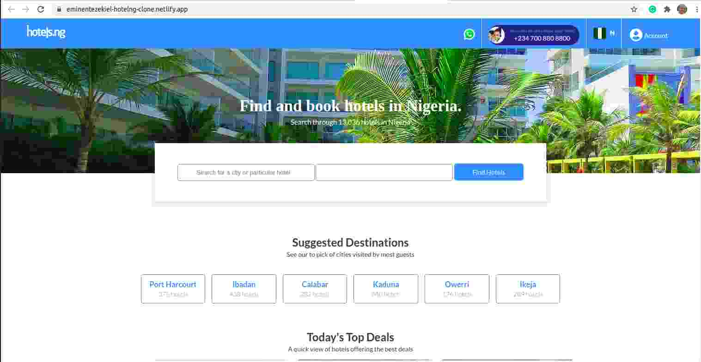

# Hotel.ng-Clone

## About The Project
This project is about creating a webpage

## Image

## Built With
* CSS
* HTML

## Author
* 👨‍🦱Ezekiel Ogunniwa
    * Github: https://github.com/Eminentzeal
    * linkedin: https://www.linkedin.com/in/ogunniwaezekiel/
    * Twitter: https://twitter.com/Ogunniwaezekiel

## Facilitators
* [Godwin Nwachukwu](https://github.com/Gnwin).

* [Chioma Nwachukwu](https://github.com/Chiomy).

## Acknowledgements
* HomeFrontStartup
  * http://homefrontstartup.com.ng/
  * Mentors International
  * https://mentorsint.com/
  * https://www.facebook.com/mentorshubyola/
  * https://twitter.com/hub_mic
  * https://www.linkedin.com/company/michub/

## Live Demo
[Click  Here to see project live](eminentezekiel-hotelng-clone.netlify.app)

# 🤝 Contributions
* This project is open to your comments and contributions, kindly reach the author through the above author's social media handles.

